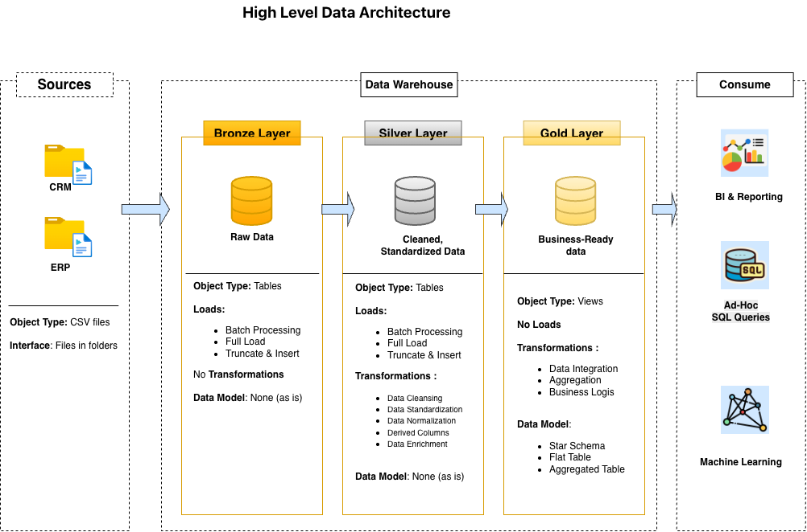

# SQL-Data-Warehouse
Building a modern data warehouse with SQL Server, including ETL processes, data modeling & analytics


## Welcome to Data Warehouse & Analytics Project

This project demonstrates a comprehensive data warehousing and analytics solution, from building a data warehouse to generating actionable insights. Designed as a portfolio project, highlights industry best practices in Data Engineering and analytics

---
## Data ArchitectureProject Overview
This project involves:

Data Architecture: Designing a Modern Data Warehouse Using Medallion Architecture Bronze, Silver, and Gold layers.
ETL Pipelines: Extracting, transforming, and loading data from source systems into the warehouse.
Data Modeling: Developing fact and dimension tables optimized for analytical queries.
Analytics & Reporting: Creating SQL-based reports and dashboards for actionable insights.
🎯 This repository is an excellent resource for professionals and students looking to showcase expertise in:

SQL Development
Data Architect
Data Engineering
ETL Pipeline Developer
Data Modeling
Data Analytics

The data architecture for this project follows Medallion Architecture Bronze, Silver, and Gold layers:



1. **Bronze Layer**: Stores raw data as-is from the source systems. Data is ingested from CSV Files into SQL Server Database.
2. **Silver Layer**: This layer includes data cleansing, standardization, and normalization processes to prepare data for analysis.
3. **Gold Layer**: Houses business-ready data modeled into a star schema required for reporting and analytics.

---
### Project Overview
---
This project involves:

1. **Data Architecture**: Designing a Modern Data Warehouse Using Medallion Architecture **Bronze**, **Silver**, and **Gold** layers.
**ETL Pipelines**: Extracting, transforming, and loading data from source systems into the warehouse.
**Data Modeling**: Developing fact and dimension tables optimized for analytical queries.
**Analytics & Reporting**: Creating SQL-based reports and dashboards for actionable insights.

---
## Project Requirement

### Building a Data Warehouse (Data Engineering)

#### Objective 

Develop a modern data warehouse using SQL Server to consolidate sales data, enabling analytical reporting and informed decision-making.

#### Specifications

- **Data Sources** : Import data from two source systems (ERP and CRM) provided as CSV files.
- **Data Quality** : Cleanse and resolve data quality issues prior to analysis.
- **Integration** : Combine both sources into a single, user-friendly data model designed for analytical queries.
- **Scope** : Focus on latest dataset only; historization dataset is not required
- **Documentation** : Provide clear documentation for the data model to support both business stakeholders and analytics team

--- 

### BI: Analytics & Reporting (Data Analytics)

#### Objective

Develop SQL-Based analytics to deliver detailed insights into:
- **Customer Behavior**
- **Product Performance**
- **Sales Trends**

These insights empower stakeholders with key business matrics, enabling strategic decision-making.

---

## Repository Structure
```sh
data-warehouse-project/
│
├── datasets/                           # Raw datasets used for the project (ERP and CRM data)
│
│── designs/
│   ├── bronze/                         # design of bronze layer
│   ├── silver/                         # design of silver layer
│   ├── gold/                           # design of gold layer
│
│
│
├── docs/                               # Project documentation and architecture details
│   ├── data_architecture.png           # Draw.io file shows the project's architecture
│   ├── data_catalog.md                 # Catalog of datasets, including field descriptions and metadata
│   ├── data_integration.png            # Draw.io file for the data flow diagram
│   ├── naming_conventions.md           # Consistent naming guidelines for tables, columns, and files
│
├── scripts/                            # SQL scripts for ETL and transformations
│   ├── bronze/                         # Scripts for extracting and loading raw data
│   ├── silver/                         # Scripts for cleaning and transforming data
│   ├── gold/                           # Scripts for creating analytical models
│
├── tests/                              # Test scripts and quality files
│
├── README.md                           # Project overview and instructions
└── LICENSE                             # License information for the repository
```
## Licence

This project is lincenced under the Click [MIT Licence](https://github.com/sayali-chougule/SQL-Data-Warehouse?tab=readme-ov-file#). Free to use, modify and share this project with proper attribution

---

## About Me

Hi there! I am **Sayali Chougule**. A Data Scientist with 5+ years of experience. 